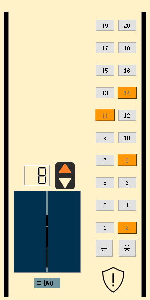

# 电梯调度系统设计方案报告
操作系统第一次课程作业 - 电梯调度

1851007 武信庭

[TOC]

## 一、项目概述
### 1.1 需求分析
​	运用操作系统进程管理的知识，结合操作系统调度算法，模拟电梯调度的功能。本电梯模拟系统有5个电梯，共20层楼。每个电梯在每一层有一个操作面板，往上和往下按钮。每次按下按钮，五部电梯同时响应，将执行调度算法，选择最优电梯进行调度，尽可能模拟真实电梯情况。

### 1.2 系统功能
#### 1.2.1 基本功能
- 电梯内部功能键：数字键、关门键、开门键、报警键
- 电梯状态显示：当前电梯的楼层数、上升及下降状态，当前电梯层数的数码显示器
- 电梯外部功能键：每层楼的上行键、下行键
- 五部电梯外部按钮共用
- 所有电梯初始状态都在第一层
- 每个电梯如果在它的上层或者下层没有相应请求情况下，在原地保持不动

### 1.3 开发工具

- **开发环境**：windows10, pycharm professional 2019.3.3
- **开发语言**：python3.7
- **引用块内容：**PyQt5 (QTimer, QtCore, QtGui, QtWidgets), pyqt5-tools, threading


### 1.4 使用说明

#### 1.4.1 打包使用说明：

​	可执行文件于windows10环境下使用RAR自解压模块打包，双击提交文件中安装程序即可，安装说明详见安装程序

#### 1.4.2 功能使用说明：

​	模拟电梯中，电梯内部按钮在每部电梯旁，外部按钮在顶部选择栏确定楼层后选择上下方向按钮，内部按钮请求未完成时为橙色，完成后还原为透明表示可用，外部按钮请求未完成时为蓝色，完成后同样变为透明，如电梯0所示；开/关按钮按下后电梯门将会打开/关闭，如电梯1所示；警报按钮按下后将会提示该电梯损坏，将被停用，然后按钮将会变灰以此交互告知该电梯被禁用，且其按钮无法被点击


## 二、设计架构
### 2.1 调度算法设计

#### 2.1.1 内部调度算法

- 内部调度含义：每部电梯调度来自内部按钮的请求

- 调度算法：**LOOK算法**

  

  - **SCAN扫描算法**：
  
    > **扫描算法定义**：
    >
    > ​	扫描算法(SCAN)是一种按照楼层顺序依次服务请求的算法。
    >
    > **扫描算法原理**：
    >
    > ​	它让电梯在最底层和最顶层之间连续往返运行，在运行过程中响应处在于电梯运行方向相同的各楼层上的请求。
    >
    > **扫描算法优点**：
    >
    > ​	扫描算法较好地解决了电梯移动的问题，在这个算法中，每个电梯响应乘客请求使乘客获得服务的次序是由其发出请求的乘客的位置与当前电梯位置之间的距离来决定的，所有的与电梯运行方向相同的乘客的请求在一次电梯向上运行或向下运行的过程中完成，免去了电梯频繁的来回移动。
    >
    > **扫描算法缺陷**：
  >
    > ​	电梯所移动的方向上不再有内请求时，电电梯仍旧会运行至最顶层/最底层，导致电梯资源的浪费。

  

  - **LOOK算法**：
  
    > **LOOK算法定义**：
    >
    > ​	LOOK算法是基于SCAN扫描算法的一种改进算法。
    >
    > **LOOK算法原理**：
    >
    > ​	对LOOK算法而言，电梯同样在最底层和最顶层之间运行。但当LOOK算法发现电梯所移动的方向上不再有内请求时立即改变运行方向。
    >
    > **LOOK算法实现**：
    >
    > ​	扫描内调度队列，完成电梯所移动方向上的内请求后改变运动状态：
    >
    > ​		a.	如内调度队列中仍旧存在其它方向上的请求，则改变运动方向；
    >
    > ​		b.	否则，改变运动状态为停止等待。
    >
    > **LOOK算法优点**：
    >
    > ​	免去了电梯多余的来回移动距离并且避免“饥饿”现象，最大限度地缩短平均响应时间，提高稳定性。


- 内调度流程图

  
  
  


#### 2.1.2 外部调度算法

- 外部调度含义：5部电梯调度来自外部楼层按钮的请求

- 调度算法：依据现实情况中人们对电梯的使用需求，采用以距离为标准的**优先级调度算法**，且针对当前运行方向和乘客目标楼层方向相同的顺路电梯与不顺路电梯优先级算法做出区别

- 改进思路：对空闲状态下的电梯的**调度优先级**进行改进，当不同电梯对同一请求有相同距离，将优先调度其中空闲的一部，在保证效率的同时尽可能让其余空闲电梯运行起来，以此改善实际生活中常常遇见的电梯乘客拥挤与资源分配失衡情况。

  

  - **优先级调度算法**：

    > **优先级调度**：   
    >
    > ​		以顺路与否为条件，以距离为标准判定，计算每部电梯的优先级
    >
    > **优先级计算**：
    >
    > ​        a.	若当前楼层顺路，则计算目标楼层与当前楼层的距离，距离越短优先级越高
    >
    > ​		b.	若不顺路且方向相反，则计算队列中最后的重点楼层与目标楼层的距离，距离越短优先级越高
    >
    > ​		c.	若不顺路且方向相同，则计算队列中最后的重点楼层与目标楼层的距离，距离越短优先级越高，但较其他情况优先级较低（与电梯下个运动方向相反，耗费较大）
    >
    > ​		d.	若距离相同，则空闲的电梯（即静止状态下的电梯）优先度较高
    >
    > **优先级的实现**：
    >
    > ​		计算出所有电梯的优先级后将该请求放入优先级最高的电梯的调度队列中。


- 外调度流程图

  

  


### 2.2 界面设计

#### 2.2.1 界面逻辑

​	采用内外部UI统一界面，方便操作按钮的同时观察电梯运行情况，UI设计简洁明了，功能明确。界面顶部为外部楼层按钮模拟，可选择上下按钮，中间位置为内部开关、楼层按钮模拟及电梯状态显示模块，底部标志为警报键


#### 2.2.2 界面展示


### 2.3 类设计

#### 2.3.1 MainWindow: 界面显示

```python
class MainWindow(QtWidgets.QMainWindow, Ui_MainWindow):
    def __init__(self):
        super(MainWindow, self).__init__()
        self.PrintUi(self)
        self.setWindowTitle('Elevator')
        self.setWindowIcon(QIcon('Resources/icon.png'))
```


#### 2.3.2 Ui_MainWindow: UI设计与pyqt接口设置

```python
'UI设计与接口类'
class Ui_MainWindow(object):
    def __init__(self):
        
    # UI绘制
    def PrintUi(self, MainWindow):
    
    # 报警器槽函数    
	def warningClick(self):
	
    # 电梯内部按键槽函数
    def btnClick(self):
        
	# 外部楼层命令槽函数
    def chooseClick(self):
        
	# 开关门槽函数
    def doorClick(self):
        
	# 文字统一设置函数
    def retranslateUi(self, MainWindow):
```


#### 2.3.3 DealCommand: 动画与调度处理

```python
'动画与命令处理类'
class DealCommand(object):
    def __init__(self, Elev):

    # 开关门槽函数        
	def doorCtrl(self, whichelev, whichcommand):
        
    # 开门动画    
	def openDoor_Anim(self, whichelev):
        
    # 关门动画
    def closeDoor_Anim(self, whichelev):
        
    # 进电梯动画
    def peopleIn_Anim(self, whichelev):    
        
    # 出电梯动画
    def peopleOut_Anim(self, whichelev):    
        
    # 门置顶
    def setDoorTop(self, whichelev): 
        
    # 乘客置顶
    def setpeopleTop(self, whichelev):   
        
    # 电梯内部按键命令
    def insideDispatch(self, whichelev, dest):   
        
    # 外部楼层命令处理
    def outsideDispatch(self, whichfloor, choice):    
        
    # 警报器槽函数
    def warnCtrl(self, whichelev):    
        
    # 更新电梯状态
    def UdEleState(self):    
```


### 2.3 数据结构设计

#### 2.3.1 状态常量设计

| 常量名       | 取值 | 作用             |
| ------------ | ---- | ---------------- |
| OPEN         | 0    | 电梯门开状态     |
| CLOSED       | 1    | 电梯门关状态     |
| GOUP         | 1    | 乘客请求为上行   |
| GODOWN       | 2    | 乘客请求为下行   |
| RUNNING_UP   | 1    | 电梯当前正在上行 |
| RUNNING_DOWN | 2    | 电梯当前正在下行 |
| STANDSTILL   | 0    | 电梯当前正在静止 |
| NOPE         | 0    | 动画为空         |
| RSTART       | 1    | 动画运行就绪     |
| RSTOP        | 2    | 动画停止就绪     |
| AVAL         | 1    | 电梯可用         |
| UNAVAL       | 0    | 电梯禁用         |

#### 2.3.2 主要变量设计

| 变量名        | 类型        | 含义                         | 取值                      |
| ------------- | ----------- | ---------------------------- | ------------------------- |
| way_queue     | Array[int]  | 存放五个电梯的顺路调度队列   | 楼层1-20                  |
| rev_way_queue | Array[int]  | 存放五个电梯的不顺路调度队列 | 楼层1-20                  |
| elevEnabled   | Array[bool] | 电梯状态标志位               | 可用1，禁用0              |
| doorState     | Array[bool] | 电梯门状态标志位             | 开门0，关门1              |
| elevState     | Array[bool] | 电梯状态标志位               | 向上1，向下2，静止0       |
| animState     | Array[bool] | 动画播放状态标志位           | 空0，运行就绪1，停止就绪2 |


## 三、具体实现

### 3.1 调度算法

#### 3.1.1 内部调度算法

```python
    # 电梯内部按键命令
    def insideDispatch(self, whichelev, dest):
        curfloor = self.elev.elevNow[whichelev]  # 当前位置
        if curfloor == dest:  # 如果目标楼层为当前楼层
            if self.elev.elevState[whichelev] == STANDSTILL:  # 若电梯静止则打开门
                self.elev.doorState[whichelev] = OPEN
                self.openDoor_Anim(whichelev)
            button = self.elev.findChild(QtWidgets.QPushButton,
                                         "button {0} {1}".format(whichelev, curfloor))  # 允许点击按钮
            button.setStyleSheet("")  # 还原按钮颜色
            button.setEnabled(True)
        elif curfloor < dest:  # 若目标层数比当前层数高
            if self.elev.elevState[whichelev] == STANDSTILL:  # 电梯处于静止状态
                self.way_queue[whichelev].append(dest)  # 将目标楼层加入调度队列
            elif self.elev.elevState[whichelev] == RUNNING_UP:  # 电梯正向上运行(顺路)
                self.way_queue[whichelev].append(dest)  # 将目标楼层加入调度队列并排序
                self.way_queue[whichelev].sort()
            elif self.elev.elevState[whichelev] == RUNNING_DOWN:  # 电梯正向下运行(不顺路)
                self.rev_way_queue[whichelev].append(dest)  # 将目标楼层加入不顺路队列并排序
                self.rev_way_queue[whichelev].sort()
        else:  # 若目标层数比当前层数低
            if self.elev.elevState[whichelev] == STANDSTILL:  # 电梯处于静止状态
                self.way_queue[whichelev].append(dest)  # 将目标楼层加入调度队列
            elif self.elev.elevState[whichelev] == RUNNING_DOWN:  # 电梯正向下运行(顺路)
                self.way_queue[whichelev].append(dest)  # 将目标楼层加入调度队列并反向排序
                self.way_queue[whichelev].sort()
                self.way_queue[whichelev].reverse()
            elif self.elev.elevState[whichelev] == RUNNING_UP:  # 电梯正向上运行(不顺路)
                self.rev_way_queue[whichelev].append(dest)  # 将目标楼层加入不顺路消息队列并反向排序
                self.rev_way_queue[whichelev].sort()
                self.rev_way_queue[whichelev].reverse()
```


**截图：**




#### 3.1.2 外部调度算法

```python
    # 外部楼层命令处理
    def outsideDispatch(self, whichfloor, choice):
        enabled_list = []
        for i in range(0, 5):
            if self.elev.elevEnabled[i]:  # 筛选没损坏的电梯加入队列
                enabled_list.append(i)

        # 计算顺路电梯与目标楼层的距离，并找出最优选择
        dist = [INFINITE] * 5  #
        for enabled_elev in enabled_list:
            if self.elev.elevState[enabled_elev] == choice == GOUP and whichfloor > \
                    self.elev.elevNow[enabled_elev]:  # 向上顺路
                dist[enabled_elev] = abs(self.elev.elevNow[enabled_elev] - whichfloor)  # 计算楼层差

            elif self.elev.elevState[enabled_elev] == choice == GODOWN and whichfloor < \
                    self.elev.elevNow[enabled_elev]:  # 向下顺路
                dist[enabled_elev] = abs(self.elev.elevNow[enabled_elev] - whichfloor)  # 计算楼层差

            elif self.elev.elevState[enabled_elev] == STANDSTILL:  # 该电梯此时静止，则优先选择
                dist[enabled_elev] = 0.5 * abs(self.elev.elevNow[enabled_elev] - whichfloor)
            elif self.elev.elevState[enabled_elev] + choice == 3:  # 电梯请求反向不顺路
                dist[enabled_elev] = abs(self.way_queue[enabled_elev][-1] - whichfloor)
            else:  # 电梯同向不顺路,滞后选择
                dist[enabled_elev] = 4 * abs(self.way_queue[enabled_elev][-1] - whichfloor)
            print(dist[enabled_elev])

        best_elev = dist.index(min(dist))  # 选择距离最短的最佳电梯
        print(best_elev)

        if dist[best_elev] == 0:  # 如果最佳电梯就在用户选择的楼层
            self.elev.doorState[best_elev] = OPEN  # 开门并等待用户关闭
            self.openDoor_Anim(best_elev)
            self.elev.elevEnabled[best_elev] = UNAVAL
        else:
            self.way_queue[best_elev].append(whichfloor)  # 加入该最佳电梯的调度队列
            if choice == GOUP:  # 若此时为向上顺路则加入当前调度队列并排序
                self.way_queue[best_elev].sort()
            else:  # 若此时为向下顺路则加入当前调度队列并反向排序
                self.way_queue[best_elev].sort()
                self.way_queue[best_elev].reverse()
            button = self.elev.findChild(QtWidgets.QPushButton,
                                         "button {0} {1}".format(best_elev, whichfloor))  # 标识目标楼层
            button.setStyleSheet("background-color: rgb(11, 15, 255);")
            button.setEnabled(False)

```


**截图：**


### 3.2 UI绘制

```python
    # UI绘制
    def PrintUi(self, MainWindow):
        MainWindow.setObjectName("MainWindow")
        MainWindow.resize(1400, 700)
        MainWindow.setStyleSheet("")
        self.centralwidget = QtWidgets.QWidget(MainWindow)
        self.centralwidget.setObjectName("centralwidget")
        MainWindow.setCentralWidget(self.centralwidget)
        self.menubar = QtWidgets.QMenuBar(MainWindow)
        self.menubar.setGeometry(QtCore.QRect(0, 0, 1400, 18))
        self.menubar.setObjectName("menubar")
        MainWindow.setMenuBar(self.menubar)
        self.statusbar = QtWidgets.QStatusBar(MainWindow)
        self.statusbar.setObjectName("statusbar")
        MainWindow.setStatusBar(self.statusbar)
        self.retranslateUi(MainWindow)
        QtCore.QMetaObject.connectSlotsByName(MainWindow)
```


**截图：**


### 3.3 按钮交互

```python
# 电梯内楼层按键
        layerbtn_pos = [180, 450, 730, 1010, 1290]
        for i in range(0, len(layerbtn_pos)):
            self.layerbtn.append(QtWidgets.QWidget(self.centralwidget))
            self.layerbtn[i].setGeometry(QtCore.QRect(layerbtn_pos[i] + 10, 120, 81, 451))
            self.layerbtn[i].setObjectName("layerbtn" + str(i))
            self.layer.append(QtWidgets.QGridLayout(self.layerbtn[i]))
            self.layer[i].setContentsMargins(0, 0, 0, 0)
            self.layer[i].setObjectName("layer" + str(i))

        names = ['19', '20', '17', '18', '15', '16', '13', '14', '11', '12', '9', '10', '7', '8', '5', '6', '3', '4',
                 '1', '2']
        positions = [(i, j) for i in range(10) for j in range(2)]  # 画按键表格
        for i in range(0, len(layerbtn_pos)):
            for position, name in zip(positions, names):
                button = QtWidgets.QPushButton(name)
                button.setObjectName("button " + str(i) + ' ' + name)
                button.setStyleSheet("")
                button.clicked.connect(MainWindow.btnClick)  # 绑定电梯内部楼层按键槽函数
                self.layer[i].addWidget(button, *position)
# 开关键
        openbtn_pos = [180, 450, 730, 1010, 1290]
        closebtn_pos = [225, 495, 775, 1055, 1335]
        for i in range(0, len(openbtn_pos)):
            self.openbtn.append(QtWidgets.QPushButton(self.centralwidget))
            self.openbtn[i].setGeometry(QtCore.QRect(openbtn_pos[i] + 10, 565, 35, 35))
            self.openbtn[i].setObjectName("openbtn" + str(i))
            self.closebtn.append(QtWidgets.QPushButton(self.centralwidget))
            self.closebtn[i].setGeometry(QtCore.QRect(closebtn_pos[i] + 10, 565, 35, 35))
            self.closebtn[i].setObjectName("closebtn" + str(i))

            self.openbtn[i].clicked.connect(MainWindow.doorClick)  # 绑定门开关键槽函数
            self.closebtn[i].clicked.connect(MainWindow.doorClick)
# 下拉框
        self.comboBox = QtWidgets.QComboBox(self.centralwidget)
        self.comboBox.setGeometry(QtCore.QRect(630, 55, 111, 31))
        self.comboBox.setObjectName("comboBox")
        for i in range(0, 20):
            self.comboBox.addItem(str(i + 1))  # 加入楼层信息

# 按钮提示信息
        self.chooselabel1 = QtWidgets.QLabel(self.centralwidget)
        self.chooselabel1.setGeometry(QtCore.QRect(670, 20, 161, 30))
        self.chooselabel1.setStyleSheet("font: 13pt \"微软雅黑\";\n")
        self.chooselabel1.setObjectName("chooselabel1")
        self.chooselabel2 = QtWidgets.QLabel(self.centralwidget)
        self.chooselabel2.setGeometry(QtCore.QRect(795, 20, 161, 30))
        self.chooselabel2.setStyleSheet("font: 13pt \"微软雅黑\";\n")
        self.chooselabel2.setObjectName("chooselabel2")

# 上行按钮
        self.upbtn = QtWidgets.QPushButton(self.centralwidget)
        self.upbtn.setGeometry(QtCore.QRect(760, 40, 50, 50))
        self.upbtn.setStyleSheet("QPushButton{border-image: url(Resources/up.png)}"
                                 "QPushButton:hover{border-image: url(Resources/up_hover.png)}"
                                 "QPushButton:pressed{border-image: url(Resources/up_press.png)}")
        self.upbtn.setObjectName("upbtn")

# 下行按钮
        self.downbtn = QtWidgets.QPushButton(self.centralwidget)
        self.downbtn.setGeometry(QtCore.QRect(810, 40, 50, 50))
        self.downbtn.setStyleSheet("QPushButton{border-image: url(Resources/down.png)}"
                                   "QPushButton:hover{border-image: url(Resources/down_hover.png)}"
                                   "QPushButton:pressed{border-image: url(Resources/down_press.png)}")
        self.downbtn.setObjectName("downbtn")

        self.upbtn.clicked.connect(MainWindow.chooseClick)  # 绑定楼层命令槽函数
        self.downbtn.clicked.connect(MainWindow.chooseClick)
# 报警器
        warnbtn_pos = [190, 460, 740, 1020, 1300]
        for i in range(0, len(warnbtn_pos)):
            self.warnbtn.append(QtWidgets.QPushButton(self.centralwidget))
            self.warnbtn[i].setGeometry(QtCore.QRect(warnbtn_pos[i] + 10, 620, 50, 50))
            self.warnbtn[i].setStyleSheet("QPushButton{border-image: url(Resources/warn.png)}"
                                          "QPushButton:hover{border-image: url(Resources/warn_hover.png)}"
                                          "QPushButton:pressed{border-image: url(Resources/warn_press.png)}")
            self.warnbtn[i].setObjectName("warnbtn" + str(i))
        for i in range(0, len(self.warnbtn)):
            self.warnbtn[i].clicked.connect(MainWindow.warningClick)  # 绑定报警器槽函数
```


**截图：**


### 3.4 动画效果

***动画实现效果见程序**

#### 3.4.1 开关门动画

```python
    # 开门动画
    def openDoor_Anim(self, whichelev):
        self.elev.ele_anim[2 * whichelev].setDirection(QAbstractAnimation.Forward)  # 正向动画
        self.elev.ele_anim[2 * whichelev + 1].setDirection(QAbstractAnimation.Forward)
        self.elev.ele_anim[2 * whichelev].start()  # 播放
        self.elev.ele_anim[2 * whichelev + 1].start()

    # 关门动画
    def closeDoor_Anim(self, whichelev):
        self.elev.ele_anim[2 * whichelev].setDirection(QAbstractAnimation.Backward)  # 反向动画
        self.elev.ele_anim[2 * whichelev + 1].setDirection(QAbstractAnimation.Backward)
        self.elev.ele_anim[2 * whichelev].start()  # 播放
        self.elev.ele_anim[2 * whichelev + 1].start()
```


#### 3.4.2 乘客进入动画

```python
    # 乘客进电梯动画
    def peopleIn_Anim(self, whichelev):
        self.elev.people[whichelev].setVisible(True)
        self.elev.people_anim[whichelev].setDirection(QAbstractAnimation.Forward)
        self.elev.people_anim[whichelev].start()

        s = threading.Timer(1.5, self.setDoorTop, (whichelev,))  # 1.5秒后把门至于顶层
        s.start()

    # 乘客出电梯动画
    def peopleOut_Anim(self, whichelev):
        self.elev.people[whichelev].setVisible(True)
        self.elev.people_anim[whichelev].setDirection(QAbstractAnimation.Backward)
        self.elev.people_anim[whichelev].start()

        s = threading.Timer(1, self.setpeopleTop, (whichelev,))  # 1s后把乘客至于顶层
        s.start()
```


#### 3.4.2 图层置顶动画

```python
    # 将门至于顶层
    def setDoorTop(self, whichelev):
        self.elev.ele_door[2 * whichelev].raise_()
        self.elev.ele_door[2 * whichelev + 1].raise_()

    # 将乘客至于顶层
    def setpeopleTop(self, whichelev):
        self.elev.people[whichelev].raise_()
        self.elev.people[whichelev].setVisible(False)
```


### 3.5 状态更新

**实现说明**：

采用定时器每隔一秒更新一次状态，检测五部电梯的调度队列是否存在待执行请求，并获取队列首元素（即当前目标楼层），同时执行相应动作。若检测到有队列的顺路队列为空但不顺路队列不为空，则交换两个队列

```python
    # 更新电梯状态
    def UdEleState(self):
        for i in range(0, len(self.way_queue)):  # 遍历五部电梯
            if len(self.way_queue[i]):  # 若有电梯的调度队列不为空
                if self.elev.doorState[i] == OPEN:  # 若电梯门是打开的则等待电梯关门
                    continue
                elif self.elev.elevState[i] == STANDSTILL:  # 若电梯处于静止状态
                    self.openDoor_Anim(i)
                    self.peopleIn_Anim(i)
                    if self.elev.elevNow[i] < self.way_queue[i][0]:  # 更新电梯状态
                        self.elev.elevState[i] = RUNNING_UP
                    elif self.elev.elevNow[i] > self.way_queue[i][0]:
                        self.elev.elevState[i] = RUNNING_DOWN
                    self.elev.animState[i] = RSTART  # 动画变为就绪运行状态

                elif self.elev.animState[i] == RSTART:  # 动画处于就绪运行状态
                    self.closeDoor_Anim(i)
                    self.elev.animState[i] = NOPE  # 动画变为运行状态

                elif self.elev.animState[i] == RSTOP:  # 动画处于就绪停止状态
                    self.way_queue[i].pop(0)  # 结束该命令的处理
                    self.closeDoor_Anim(i)
                    self.elev.animState[i] = NOPE
                    self.elev.elevState[i] = STANDSTILL  # 电梯变为静止状态
                    self.elev.elestate[i].setStyleSheet("QGraphicsView{border-image: url(Resources/state.png)}")

                else:  # 电梯移动
                    destFloor = self.way_queue[i][0]  # 获取第一个目标楼层
                    if self.elev.elevNow[i] < destFloor:  # 向上
                        self.elev.elevState[i] = RUNNING_UP
                        self.elev.elestate[i].setStyleSheet(
                            "QGraphicsView{border-image: url(Resources/state_up.png)}")
                        self.elev.elevNow[i] = self.elev.elevNow[i] + 1  # 将当前楼层加一
                        self.elev.layernum[i].setProperty("value", self.elev.elevNow[i]) 

                    elif self.elev.elevNow[i] > destFloor:  # 向下
                        self.elev.elevState[i] = RUNNING_DOWN
                        self.elev.elestate[i].setStyleSheet(
                            "QGraphicsView{border-image: url(Resources/state_down.png)}")
                        self.elev.elevNow[i] = self.elev.elevNow[i] - 1  # 将当前楼层减一
                        self.elev.layernum[i].setProperty("value", self.elev.elevNow[i]) 

                    else:  # 电梯到达目的层
                        self.openDoor_Anim(i)
                        self.peopleOut_Anim(i)
                        self.elev.animState[i] = RSTOP  # 动画变为就绪停止状态

                        button = self.elev.findChild(QtWidgets.QPushButton,
                                                     "button {0} {1}".format(i, self.elev.elevNow[i]))  # 恢复该按钮的状态
                        button.setStyleSheet("")
                        button.setEnabled(True)

            elif len(self.rev_way_queue[i]):  # 电梯反向移动
                self.way_queue[i] = self.rev_way_queue[i].copy()  # 交换两个队列
                self.rev_way_queue[i].clear()  # 清空不顺路队列

        # 禁用电梯运行过程中的报警功能
        for i in range(0, 5):
            if self.elev.layerbtn[i].isEnabled():  # 如果这个电梯没被禁用
                if self.elev.elevState[i] == STANDSTILL:  # 如果电梯是静止的
                    self.elev.warnbtn[i].setEnabled(True)
                else:
                    self.elev.warnbtn[i].setEnabled(False)

```


## 四、运行测试
#### 4.1 上升时顺路带走要上楼乘客


#### 4.2 下降时顺路带走要下楼乘客


#### 4.3 手动开关门


#### 4.4 空闲电梯优先调度


#### 4.5 多台电梯同时运行


#### 4.6 警报功能


#### 4.7 内外共同调度


## 五、小结

​	经过本次作业的学习和编写，我积累了对python与其GUI包pyqt5的实践经验，了解了pyqt接口与相应库函数的使用方法和特性，也掌握了特定环境下与以往所编写的控制台程序不同的开发和调试方法

​	同时我对于操作系统课程有了更深的理解，用线程模拟进程，每一部电梯是⼀个进程，而所有的请求是资源，我们做这个电梯的目的是模拟进程调度的问题，也就是模拟所有的请求资源如何分配给电梯，电梯应该先完成哪些资源的情况，而我设计的调度算法也让我对课内外不同的进程调度算法有了更全面、更透彻的理解，在改进原优先级算法时我全面了解了几种调度算法的优劣，相信这对我本门课程的学习有所裨益。

​	最后这个程序的完成还应感谢几位学长对动画、控件部分和算法思路的指导建议，以及学习pyqt过程中CSDN博客的教程与解惑，这个程序仍有一定改善空间，如部分函数冗余以及结构设计问题，希望将来有机会进行改进。