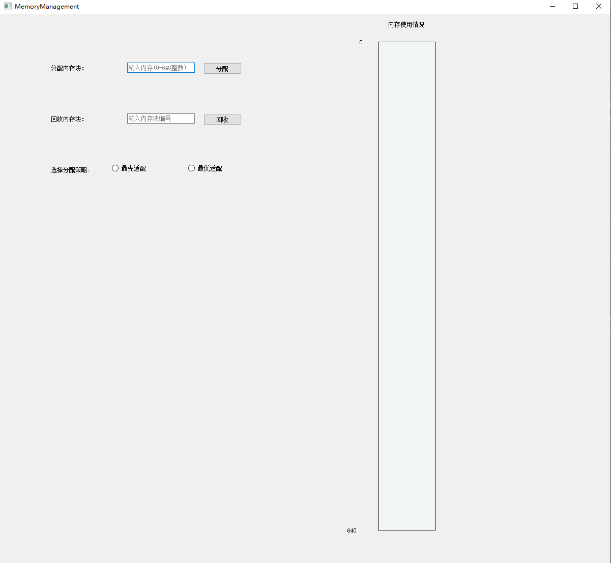
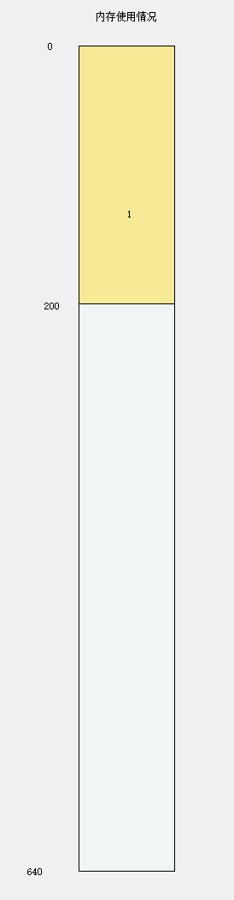
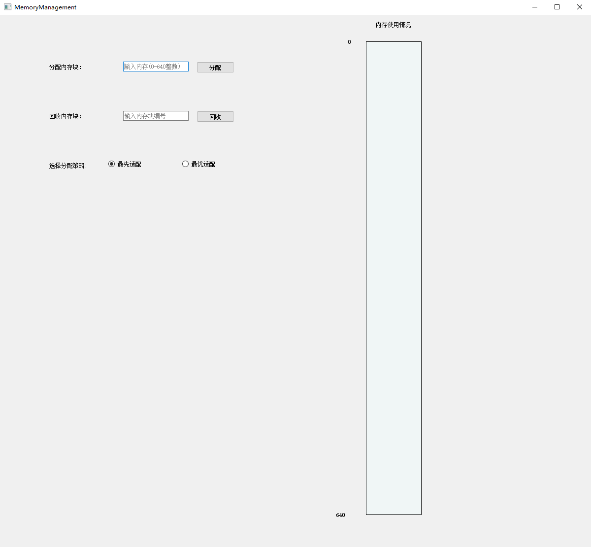
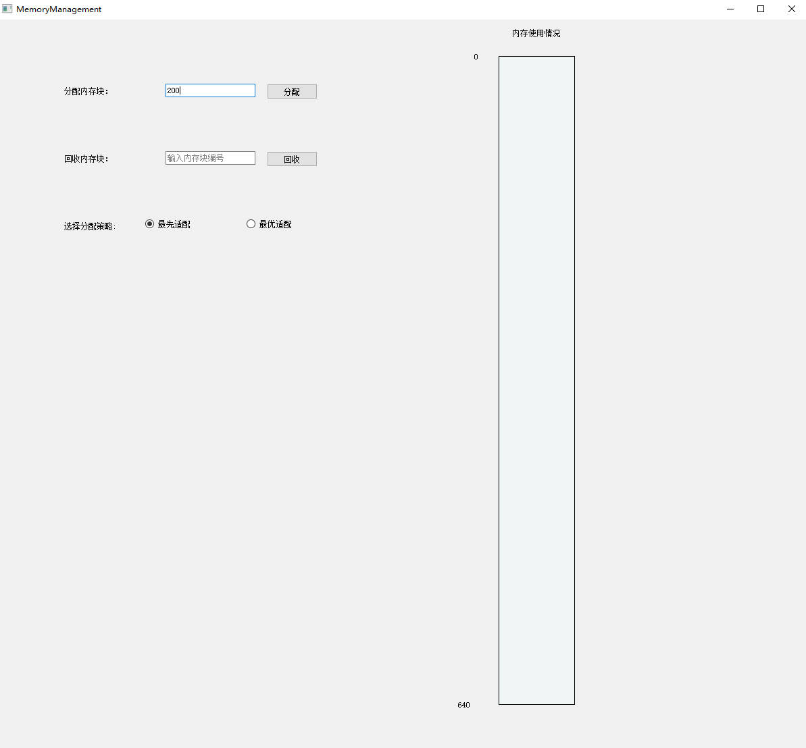
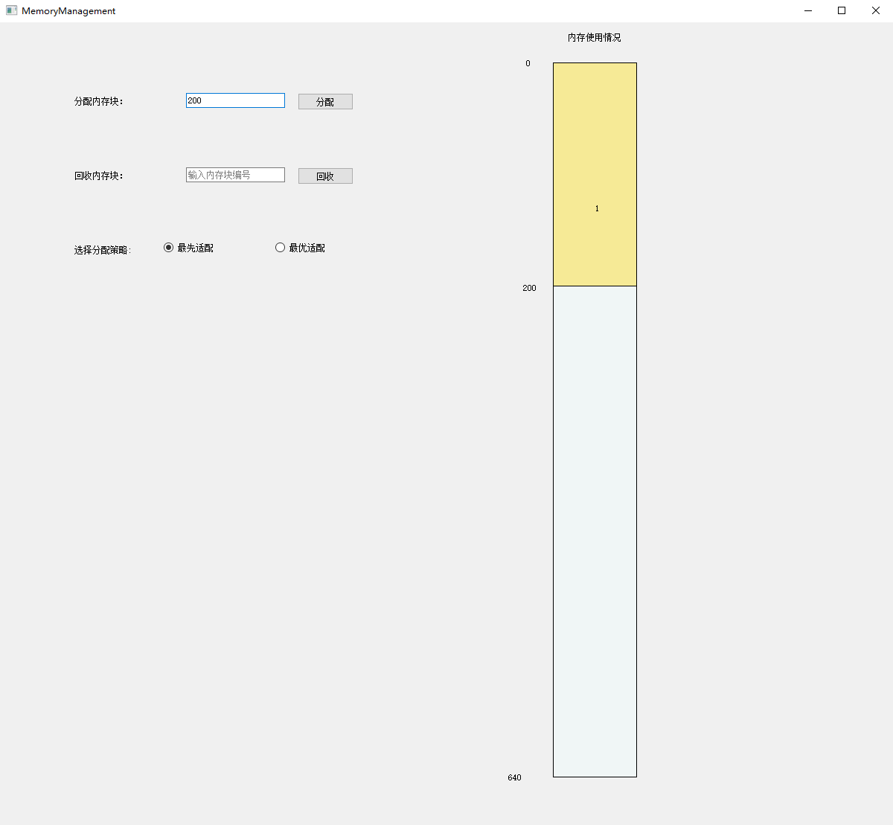
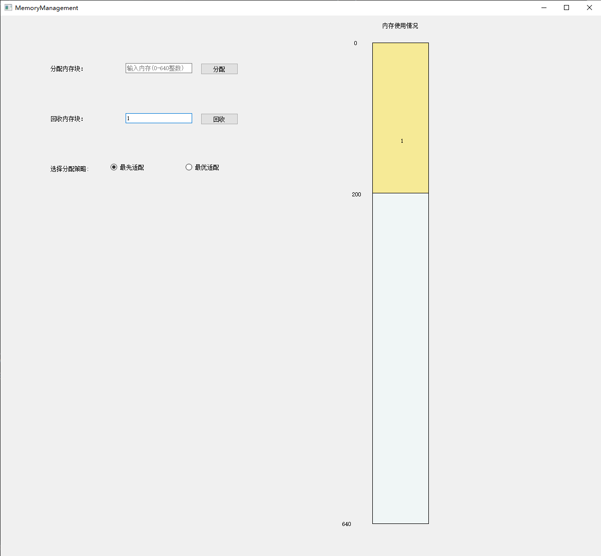
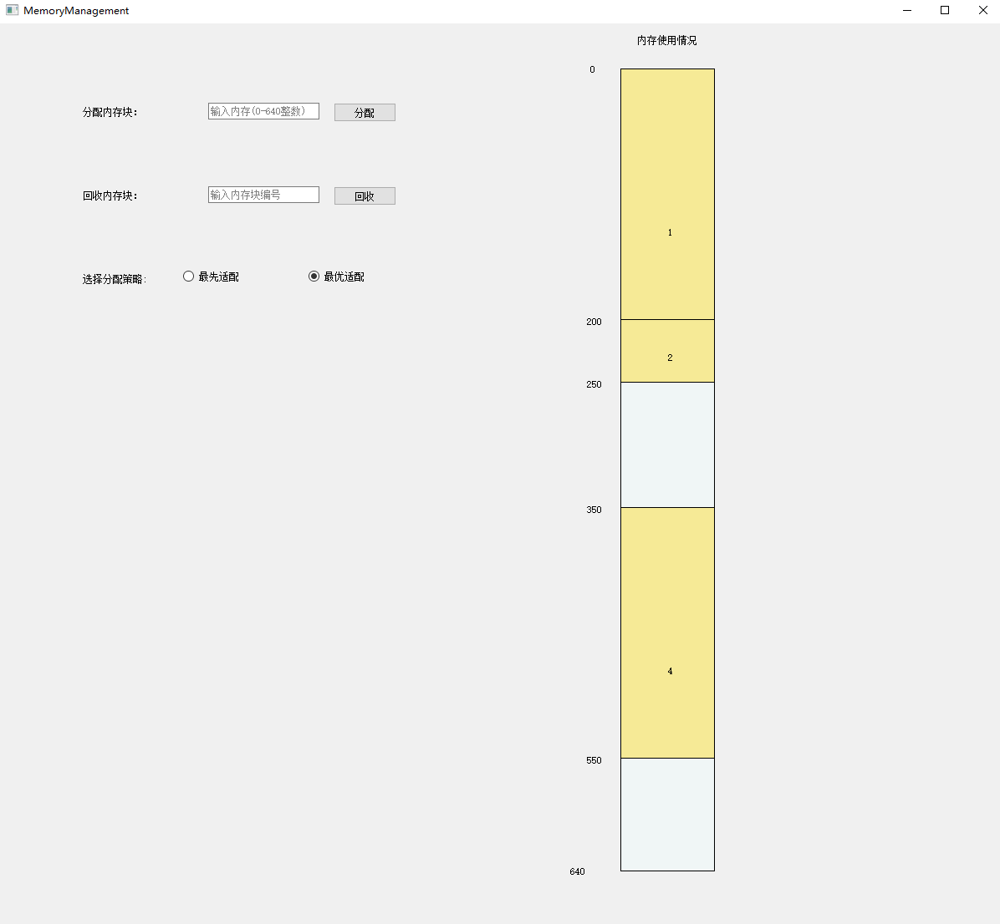
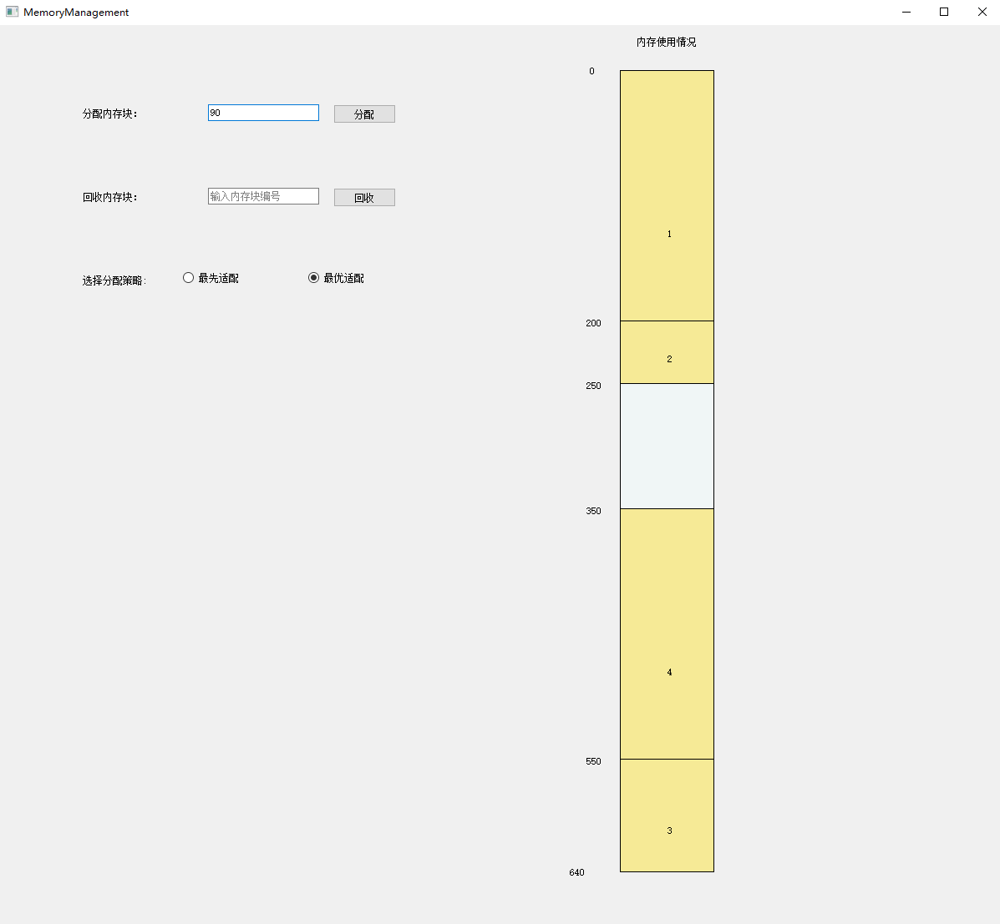

# 动态分区分配方式设计方案报告
操作系统第二次课程作业 - 内存管理

1851007 武信庭

[TOC]

## 一、项目概述
### 1.1 需求分析
​	假设初始态下，可用内存空间为640K，并有下列请求序列，分别用首次适应算法和最佳适应算法进行内存块的分配和回收，并显示出每次分配和回收后的空闲分区链的情况。

### 1.2 系统功能
#### 1.2.1 基本功能
- 分配内存
- 回收内存
- 可选择内存分配方式（最先适配/最优适配）
- 实时显示当前内存分区分配情况

### 1.3 开发工具

- **开发环境**：windows10, pycharm professional 2019.3.3
- **开发语言**：python3.7
- **引用块内容：**PyQt5 (QtCore, QtGui, QtWidgets), pyqt5-tools


### 1.4 使用说明

#### 1.4.1 打包使用说明：

​	本程序已打包整合运行库，双击开始即可

#### 1.4.2 功能使用说明：

​	请先选择一种分配方式，然后输入分配内存块大小，点击分配开始模拟内存动态分区分配过程，过程中可随时输入想要回收的内存块编号回收内存，右侧将实时显示当前内存分区及使用情况


## 二、设计架构
### 2.1 内存分配算法设计

#### 2.1.1 最先适配算法

- 算法思想：按分区先后次序从头查找，找到符合要求的第一个分区。
- 算法实质：尽可能利用存储区低地址空闲区，尽量在高地址部分保存较大空闲区，以便一旦有分配大空闲区要求时，容易得到满足。
- 优点：分配简单，合并相邻空闲区也比较容易
- 缺点：查找总是从表首开始，前面空闲区往往被分割的很小，满足分配要求的可能性较小，查找次数较多。


#### 2.1.2 最优适配算法

- 算法思想：在所有大于或者等于要求分配长度的空闲区中挑选一个最小的分区，即对该分区所要求分配的大小来说，是最合适的。分配后，所剩余的块会最小。
- 算法实质：在空闲存储区中从小到大查找并调用第一个空闲分区
- 优点：较大的空闲分区可以被保留。
- 缺点：空闲区是按大小而不是按地址顺序排列的 ，因此释放时，要在整个链表上搜索地址相邻的空闲区，合并后，又要插入到合适的位置。


### 2.2 界面设计

#### 2.2.1 界面逻辑

​	整体界面采用简洁易懂的UI设计，左侧为操控区，负责选择宣发及输入分区大小、回收编号等，右侧为显示区，负责用户交互与展示当前内存分区情况，UI清爽且职能分明、易于上手。


#### 2.2.2 界面展示




### 2.3 类设计

#### 2.3.1 界面显示类

```python
class MainWindow(QWidget):
    # 默认属性和参数
    (mem_width, mem_height) = (112.5, 960)
    free_color = QColor(240, 255, 255, 100)
    busy_color = QColor(255, 215, 0, 100)
    (start_x, start_y) = (0, 0)
    ratio = 1.5

    (MaxIndex, BlockIndex) = (640, 1)
    # 输入控件
    RequiredMemory = None
    RequiredIndex = None
    SubmitMemory = None
    SubmitIndex = None

    # 已分配内存块列表
    DeployList = None
    # 未分配的空闲块表
    FreeList = None

    def __init__(self):
        super().__init__()
        self.DeployList = []
        self.FreeList = []
        # 初始化空闲表
        InitialFreeBlock = MemoryBlock()
        InitialFreeBlock.setProperty(addr=0, size=640, index=0, isDeploy=False)
        self.FreeList.append(InitialFreeBlock)
        self.initUI()

    def initUI(self):
        self.setGeometry(300, 300, 1200, 1080)
        self.setWindowTitle('MemoryManagement')
        self.start_x = (self.width() - self.mem_width) / 2 + 200  # 锚点
        self.start_y = self.height() * 0.05
        # 文字绘制
        label1 = QLabel(self)
        label1.setText("内存使用情况")
        label1.move(self.start_x + 20, self.start_y - 40)
        label2 = QLabel(self)
        label2.setText("0")
        label2.move(self.start_x - 36, self.start_y - 5)
        label3 = QLabel(self)
        label3.setText("640")
        label3.move(self.start_x - 60, self.start_y + self.mem_height - 5)
        
        self.InputPrint()
        qr = self.frameGeometry()
        # 获得屏幕中心点
        cp = QDesktopWidget().availableGeometry().center()
        # 显示到屏幕中心
        qr.moveCenter(cp)
        self.move(qr.topLeft())

        self.show()
```


#### 2.3.2 内存块类

```python
class MemoryBlock:
    MaxIndex = 640
    IndexPool = []

    def _init_(self):
        self.address, self.size = 0, 0
        index = 0
        isDeploy = False

    # 设置要分配的内存块的参数
    def setProperty(self, addr, size, index, isDeploy):
        self.address = addr
        self.size = size
        self.isDeploy = isDeploy
        # 不是空块
        if index != 0:
            for i in range(1, MemoryBlock.MaxIndex + 1):
                if i not in MemoryBlock.IndexPool:
                    self.index = i
                    MemoryBlock.IndexPool.append(i)
                    break
```


### 2.4 数据结构设计

##### MemoryBlock类

| 函数        | 作用                 |
| ----------- | -------------------- |
| setProperty | 设置内存的地址和大小 |

| 成员变量 | 作用         |
| -------- | ------------ |
| address  | 内存块的地址 |
| size     | 内存块的大小 |


##### Mainwindow类

| 函数名           | 作用               |
| ---------------- | ------------------ |
| allocateStrategy | 执行分配内存块策略 |
| recycleStrategy  | 执行回收内存块策略 |
| allocateMemory   | 分配内存           |
| tablePrint       | 更新内存块视图     |

| 成员变量   | 作用             |
| ---------- | ---------------- |
| DeployList | 已被分配的内存块 |
| FreeList   | 未分配的内存块   |

## 三、具体实现

### 3.1 分配内存

```python
    def allocateStrategy(self):
        scale = int(self.RequiredMemory.text())
        self.RequiredMemory.clear()
        if self.ratiobutton1.isChecked():  # 最先适配算法
            block = MemoryBlock()
            for space in self.FreeList:
                if space.size >= scale:
                    block.setProperty(addr=space.address, size=scale, index=1, isDeploy=True)
                    self.DeployList.append(block)
                    space.address = space.address + block.size
                    space.size = space.size - block.size
                    break
        elif self.ratiobutton2.isChecked():  # 最优适配算法
            block = MemoryBlock()
            anchor, gap = -1, 640
            for i in range(len(self.FreeList)):
                if self.FreeList[i].size - scale >= 0 and self.FreeList[i].size - scale < gap:
                    anchor = i
                    gap = self.FreeList[i].size - scale
            if anchor != -1:
                block.setProperty(addr=self.FreeList[anchor].address, size=scale, index=1, isDeploy=True)
                self.DeployList.append(block)
                self.FreeList[anchor].size = self.FreeList[anchor].size - scale
                self.FreeList[anchor].address = self.FreeList[anchor].address + scale
        else:
            QMessageBox.information(self, "提示", "请先选择分配策略", QMessageBox.Yes | QMessageBox.No)
        self.update()
```


### 3.2 回收内存

```python
    def recycleStrategy(self):
        recycler = int(self.RequiredIndex.text())
        self.RequiredIndex.clear()
        for i in range(len(self.DeployList)):
            if recycler == self.DeployList[i].index:
                self.FreeList.append(self.DeployList[i])
                while recycler in MemoryBlock.IndexPool:
                    MemoryBlock.IndexPool.remove(recycler)
                self.DeployList.pop(i)
                self.update()
                break
        cmpfun = operator.attrgetter('address')
        self.FreeList.sort(key=cmpfun)

        for j in range(len(self.FreeList) - 1, 0, -1):
            if self.FreeList[j].address == self.FreeList[j - 1].address + self.FreeList[j - 1].size:
                self.FreeList[j - 1].size = self.FreeList[j - 1].size + self.FreeList[j].size
                self.FreeList.pop(j)
```


### 3.3 绘制内存分配情况

```python
    def paintEvent(self, e):
        qp = QPainter()
        qp.begin(self)
        self.tablePrint(qp, self.free_color)
        for task in self.DeployList:
            self.allocateMemory(qp, task)  # 显示已分配内存
        qp.end()

    def allocateMemory(self, qp, task):
        if type(task) != MemoryBlock:
            return False

        col = QColor(0, 0, 0)
        col.setNamedColor("black")
        qp.setPen(col)
        qp.setBrush(self.busy_color)
        qp.drawRect(self.start_x, self.start_y + task.address * self.ratio, self.mem_width, task.size * self.ratio)
        qp.drawText(self.start_x + 0.5 * self.mem_width, self.start_y + task.address * self.ratio + task.size,
                    str(task.index))
        if task.address == 0:
            qp.drawText(self.start_x - 40, self.start_y + (task.address + task.size) * self.ratio + 7,
                        str(task.address + task.size))
        elif task.address + task.size != 640:
            qp.drawText(self.start_x - 40, self.start_y + task.address * self.ratio + 7, str(task.address))
            qp.drawText(self.start_x - 40, self.start_y + (task.address + task.size) * self.ratio + 7,
                        str(task.address + task.size))
```


**截图：**




## 四、运行测试
### 4.1 未分配内存




### 4.2 输入分配内存块大小




### 4.3 内存被分配




### 4.4 输入回收内存块号




### 4.5 内存被回收


### 4.6 最先适配与最优适配切换






## 五、小结

​	经过本次作业的学习和编写，我积累了对python与其GUI包pyqt5的实践经验，了解了pyqt接口与相应库函数的使用方法和特性，也掌握了特定环境下与以往所编写的控制台程序不同的开发和调试方法

​	同时我对于操作系统课程有了更深的理解，用python模拟内存分配，模拟了所有的内存资源如何动态地分配给进程，内存应该如何分页分配，而经过学习设计的两种分配算法也让我对不同的内存分配算法有了更全面、更透彻的理解，相信这对我本门课程的学习有所裨益。

​	最后这个程序的完成还应感谢几位学长对界面实现及制作思路的指导建议，以及学习pyqt过程中CSDN博客的教程与解惑，这个程序仍有一定改善空间，如部分函数冗余以及结构设计问题，希望将来有机会进行改进。