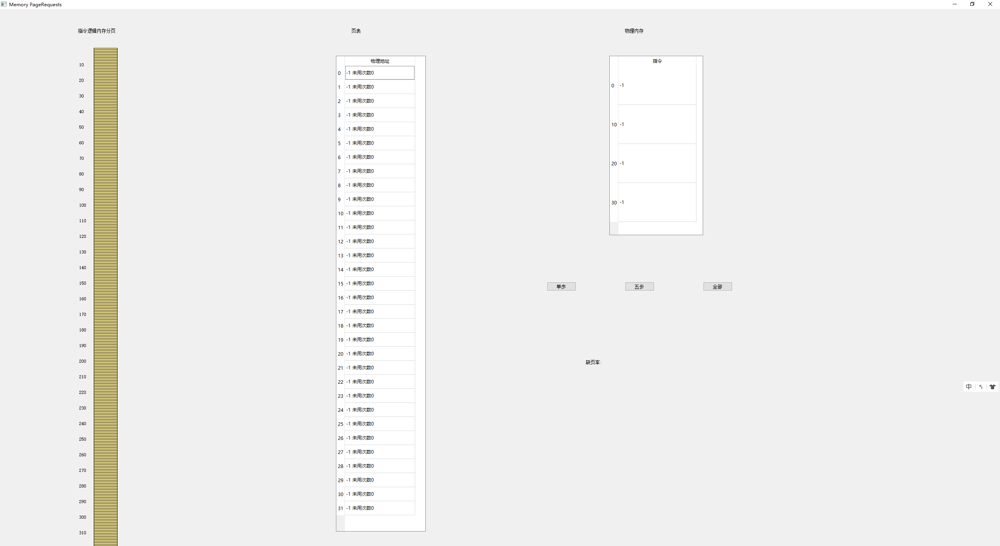
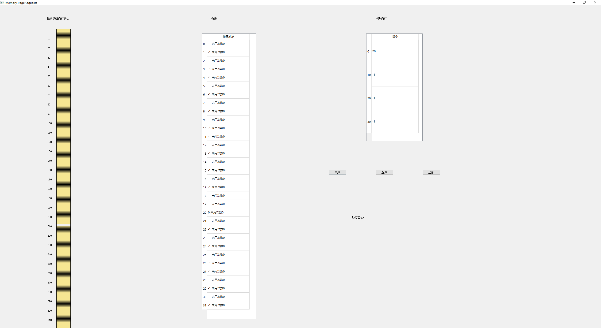
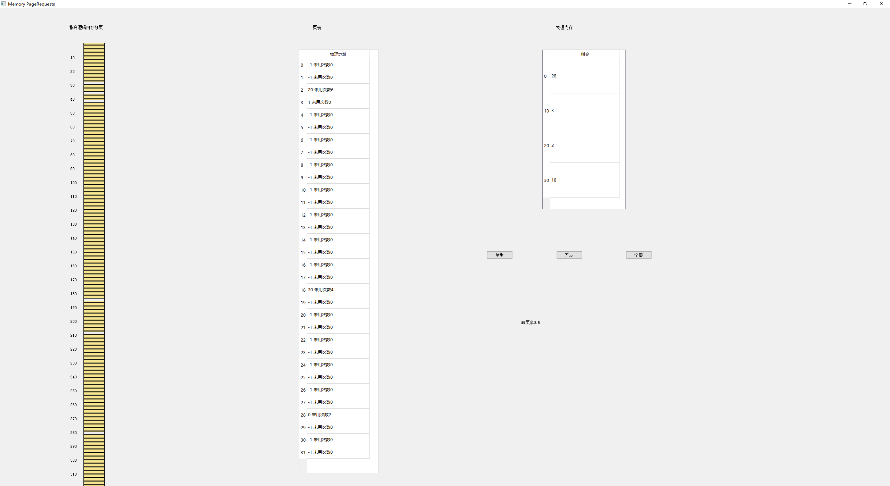
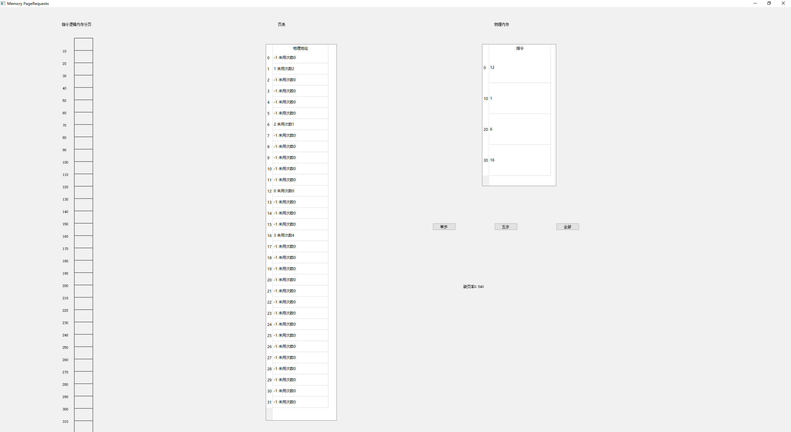

# 请求分页分配方式设计方案报告
操作系统第二次课程作业 - 内存管理

1851007 武信庭

[TOC]

## 一、项目概述
### 1.1 需求分析
- 假设每个页面可存放10条指令，分配给一个作业的内存块为4。模拟一个作业的执行过程，该作业有320条指令，即它的地址空间为32页，目前所有页还没有调入内存。

- 在模拟过程中，如果所访问指令在内存中，则显示其物理地址，并转到下一条指令；如果没有在内存中，则发生缺页，此时需要记录缺页次数，并将其调入内存。如果4个内存块中已装入作业，则需进行页面置换。
- 所有320条指令执行完成后，计算并显示作业执行过程中发生的缺页率。
- 置换算法可以选用FIFO或者LRU算法

### 1.2 系统功能
#### 1.2.1 基本功能
- 设置一个序号为0-319的指令集，每次按照一定顺序执行指令，若该页在页表中记录，则无需置换。若页表中不存在该页，则存储器中调入对应页的内容，并更新页表的索引。如需置换，置换采用LRU算法。

### 1.3 开发工具

- **开发环境**：windows10, pycharm professional 2019.3.3
- **开发语言**：python3.7
- **引用块内容：**PyQt5 (QtGui, QtWidgets), pyqt5-tools


### 1.4 使用说明

#### 1.4.1 打包使用说明：

​	本程序已打包整合运行库，双击开始即可

#### 1.4.2 功能使用说明：

​	点击单步/5步/全部指令运行，观察运行过程中页表的变化及物理内存置换过程


## 二、设计架构
### 2.1 置换算法设计

#### 2.1.1 最近最少使用页面淘汰算法(LRU)

- 算法思想：选择内存中最久未使用的页面被置换
- 算法实现：设置计数器，记录每个页表中存储于物理内存中的页面当前未被使用次数，每当有页面被访问时就置为0，其余未被访问的页面则增加未用次数，置换时选择未用次数最多页调出
- 优点：是局部性原理的合理近似，性能接近最佳算法
- 缺点：由于需要记录页面使用时间的先后关系，硬件开销太大


### 2.2 界面设计

#### 2.2.1 界面逻辑

​	整体界面采用简洁易懂的UI设计，主体为三个表格，左侧为作业逻辑地址分页，显示当前指令执行情况，中间为页表，负责显示页面使用情况与映射关系及页面未用次数，右侧围物理内存，显示作业的物理内存块使用情况，操控执行过程的按钮在右下角，可以选择单步/5步或全部执行，整体显示UI清爽明确且职能分明、易于上手。


#### 2.2.2 界面展示




### 2.3 类设计

#### 2.3.1 界面显示类

```python
class MainWindow(QWidget):
    def __init__(self):
        super().__init__()
        # 坐标定义
        self.paras = dict()
        self.paras["分页"] = {"x": 200, "y": 50, "w": 60, "h": 40}
        self.paras["页表"] = {"x": 900, "y": 50}
        self.paras["内存"] = {"x": 1600, "y": 50}
        self.paras["LRU"] = {"x": 1400, "y": 700}
        self.paras["缺页"] = {"x": 1500, "y": 900}
        self.paras["指令条数"] = 320
        self.instructions = [i for i in range(320)]  # 指令分页

        self.notice = QLabel(self)
        self.notice.setText("缺页率:    ")
        self.notice.move(self.paras["缺页"]["x"], self.paras["缺页"]["y"])

        self.PageChart = []  # 页表
        self.PhysicMem = []  # 物理内存
        self.LostNums = 0  # 缺页次数
        self.TotalNums = 0  # 总次数

        for i in range(32):
            self.PageChart.append({"memory": -1, "unused": 0})
        for i in range(4):
            self.PhysicMem.append(-1)

        self.PageTable = QTableWidget(self)
        PageTitle = ["物理地址"]
        self.PageTable.setColumnCount(1)
        self.PageTable.setRowCount(32)
        self.PageTable.setHorizontalHeaderLabels(PageTitle)
        vlabel = []
        for i in range(self.PageTable.rowCount()):
            self.PageTable.setRowHeight(i, 36)  # 设置i行的高度
            vlabel.append(str(i))
        for k in range(self.PageTable.columnCount()):
            self.PageTable.setColumnWidth(k, 180)
        self.PageTable.setVerticalHeaderLabels(vlabel)
        self.PageTable.setGeometry(self.paras["页表"]["x"] - 40, 120, 230, 1220)

        self.PhysicsMemory = QTableWidget(self)
        PhysicsTitle = ["指令"]
        self.PhysicsMemory.setColumnCount(1)
        self.PhysicsMemory.setRowCount(4)
        self.PhysicsMemory.setHorizontalHeaderLabels(PhysicsTitle)
        self.PhysicsMemory.setVerticalHeaderLabels(["0", "10", "20", "30"])
        for i in range(self.PageTable.rowCount()):
            self.PhysicsMemory.setRowHeight(i, 100)  # 设置i行的高度
        for k in range(self.PageTable.columnCount()):
            self.PhysicsMemory.setColumnWidth(k, 200)
        self.PhysicsMemory.setGeometry(self.paras["内存"]["x"] - 40, 120, 240, 460)

        self.initUi()

    def initUi(self):
        self.setGeometry(200, 200, 2250, 1450)
        self.setWindowTitle("Memory PageRequests")
        self.textPrint()  # 绘制文字
        qr = self.frameGeometry()
        # 获得屏幕中心点
        cp = QDesktopWidget().availableGeometry().center()
        # 显示到屏幕中心
        qr.moveCenter(cp)
        self.move(qr.topLeft())
        self.show()
```


### 2.4 数据结构设计

##### MemoryScene类

| 函数            | 作用                 |
| --------------- | -------------------- |
| textPrint       | 绘制页面文字元素     |
| requestStrategy | 页面的指令请求调入   |
| solveLogics     | 响应传入请求调入页面 |

| 成员变量     | 作用       |
| ------------ | ---------- |
| paras        | 初始化参数 |
| instructions | 指令分页   |
| notice       | 缺页率提示 |
| PhysicsMem   | 物理内存表 |
| PageChart    | 页表       |
| PageTable    | 页表控件   |


## 三、具体实现

### 3.1 置换算法

```python
    def solveLogics(self, instruction):
        # 获得页数
        self.TotalNums = self.TotalNums + 1
        page = int(instruction / 10)
        for i in range(len(self.PageChart)):
            if self.PageChart[i]["memory"] != -1 and self.PageChart[i]["memory"] != page:
                self.PageChart[i]["unused"] = self.PageChart[i]["unused"] + 1

        if self.PageChart[page]["memory"] == -1:
            self.LostNums = self.LostNums + 1
            flag = 0
            max_unused, anchor = -1, -1
            for i in range(len(self.PhysicMem)):
                if self.PhysicMem[i] == -1:
                    # 把该页存入内存块
                    self.PhysicMem[i] = page
                    self.PageChart[page] = {"memory": i*10, "unused": 0}
                    flag = 1
                    break
                else:  # 记录未使用次数最多的
                    if self.PageChart[self.PhysicMem[i]]["unused"] >= max_unused:
                        max_unused = self.PageChart[self.PhysicMem[i]]["unused"]
                        # 要被替换的内存块
                        anchor = i
            # 若内存块没有空余
            if flag == 0:
                self.PageChart[page] = {"memory": anchor, "unused": 0}
                self.PageChart[self.PhysicMem[anchor]] = {"memory": -1, "unused": 0}
                self.PhysicMem[anchor] = page
        elif self.PageChart[page] != -1:
            self.PageChart[page]["unused"] = 0
        text = "缺页率" + str(self.LostNums / self.TotalNums)
        self.notice.setText(text)
        print(self.LostNums / self.TotalNums)
        self.update()
```


### 3.2 绘制页表

```python
    def paintEvent(self, e):
        qp = QPainter()
        qp.begin(self)
        self.pagesPaint(qp)
    def pagesPaint(self, qp):
        col = QColor(0, 0, 0)
        col.setNamedColor("black")
        qp.setBrush(QColor(255, 215, 0, 0))
        for i in range(32):
            qp.drawRect(self.paras["分页"]["x"] + 40, self.paras["分页"]["y"] + 50 + i * self.paras["分页"]["h"],
                        self.paras["分页"]["w"], self.paras["分页"]["h"])
            qp.drawText(self.paras["分页"]["x"] + 3, self.paras["分页"]["y"] + 57 + (i + 1) * self.paras["分页"]["h"],
                        str((i + 1) * 10))

        col = QColor(0, 0, 0)
        col.setNamedColor("black")
        qp.setBrush(QColor(255, 215, 0, 100))

        for p in range(len(self.instructions)):
            qp.drawRect(self.paras["分页"]["x"] + 40,
                        self.paras["分页"]["y"] + 50 + self.instructions[p] * self.paras["分页"]["h"] * 32 / 320,
                        self.paras["分页"]["w"], self.paras["分页"]["h"] * 32 / 320)
        for k in range(len(self.PageChart)):
            phy_address = QTableWidgetItem(
                str(self.PageChart[k]["memory"]) + " 未用次数" + str(self.PageChart[k]["unused"]))
            self.PageTable.setItem(k, 0, phy_address)
        for t in range(len(self.PhysicMem)):
            phy_content = QTableWidgetItem(str(self.PhysicMem[t]))
            self.PhysicsMemory.setItem(t, 0, phy_content)
```


## 四、运行测试
### 4.1 初始页面（未执行指令）


### 4.2 单步执行




### 4.3 五步执行




### 4.4 全部执行（作业执行完成）




## 五、小结

​	经过本次作业的学习和编写，我积累了对python与其GUI包pyqt5的实践经验，了解了pyqt接口与相应库函数的使用方法和特性，也掌握了特定环境下与以往所编写的控制台程序不同的开发和调试方法

​	同时我对于操作系统课程有了更深的理解，本项目使用python模拟请求调页，应用虚拟内存思想，程序不需要全部装入内存，而是使用请求调页方法来决定所有的内存资源如何分配给进程，进程应该被分配到内存哪一块，理解了置换算法、缺页率等概念，实现了LRU和FIFO算法，对置换算法中不同算法之间的区别与思想有了进一步的认识

​	最后这个程序的完成还应感谢几位学长对界面实现及制作思路的指导建议，以及学习pyqt过程中CSDN博客的教程与解惑，这个程序仍有一定改善空间，如程序优化不足、界面设计略单调简单问题，希望将来有机会进行改进。